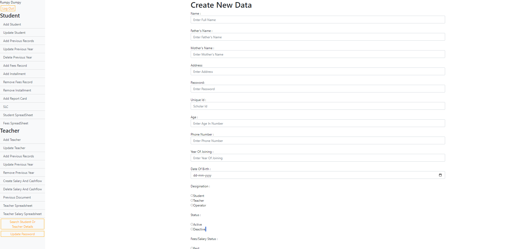

# Projects
---
## Machine learning

#### Deaf Person Voice/speech to text

* Audio Classification and Processing
* Image Processing
* Spectrogram
* SpecAugment
* Deep Learning model

---
#### Red Eye Detection & Removal Automation With High Accuracy

* Object Detection
* Image Augmentation
* Deep learning model
* Computer Vision and Image Processing

---
#### G2Net Detecting Continuous Gravitational Waves

* Dataset analysis and data preprocessing
* PCA study and deployment
* Feature recognition and extraction
* Multiple noise - multiple detector data analysis on our model
* CNN, KNN and SVM model deployment analysis

---
#### Rumpy Dumpy Academy

        

---

# Education and Certifications

## P1
#### PP1
